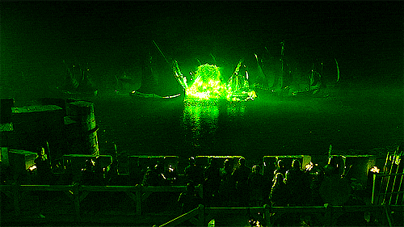

# Wildfire

### "Once it takes fire, the substance will burn fiercely until it is no more."
**- George RR Martin, A Feast for Crows***

Wildfire is a secure deletion library for Windows and .NET-executible environments. Using [SP800-88](https://nvlpubs.nist.gov/nistpubs/SpecialPublications/NIST.SP.800-88r1.pdf) conformant methods, Wildfire destroys accessible files locally or over a network to resist an adversary's attempts to recover data. These procedures ensure data is unrecoverable even if the file is stored on storage media or a filesystem that does not immediately overwrite data marked for deletion (a common characteristic of most file and storage systems). 

### Secure Deletion Modes

Wildfire supports two modes of secure file deletion:

**Zeroing**: Wildfire 'zeroes' a file by overwriting all of its contents with '0' at the byte level. This can be configured to run multiple times, such that a file is zeroed multiple times. 

**Cryptoshredding**: Wildfire implements secure deletion using the [AES-256 GCM](https://en.wikipedia.org/wiki/Galois/Counter_Mode) algorithm. It encrypts data at the byte level using ephemeral and cryptographically random keys, then deletes the file. 

### Source Code

*Sanitizer.cs*: This class contains the code for performing data sanitization via single pass and multi-pass zeroing.

*Cryptoshredder.cs*: This class contains the code to performing cryptoshredding via AES-256 GCM, including ephemeral key material generation and management. 

*CLI.cs*: This is a simple testing CLI for executing secure deletion. 

### License

Wildfire and its source code are licensed under the [MIT License](https://en.wikipedia.org/wiki/MIT_License). 
